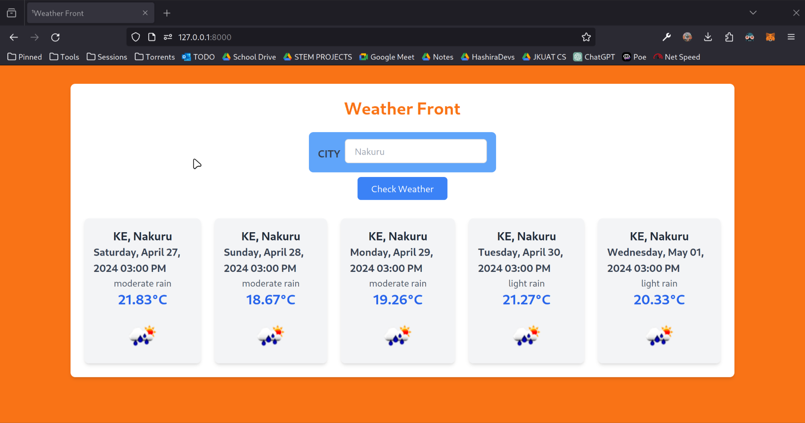
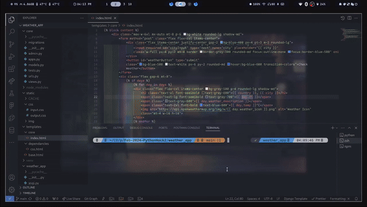

# WEATHER FRONT

Get an accurate weather forecast in seconds!

## INTRODUCTION

Weather Front is a Django web application designed to provide users with accurate weather forecasts for up to 5 days. It leverages the OpenWeatherMap API to fetch real-time weather data and presents it through a user-friendly interface.

## IMAGE

The image above showcases Weather Front in action, displaying the forecast for a particular location.

## VIDEO

The video provides a brief demonstration of Weather Front's features and functionality.
# plp-WebDevelopment_Finale
